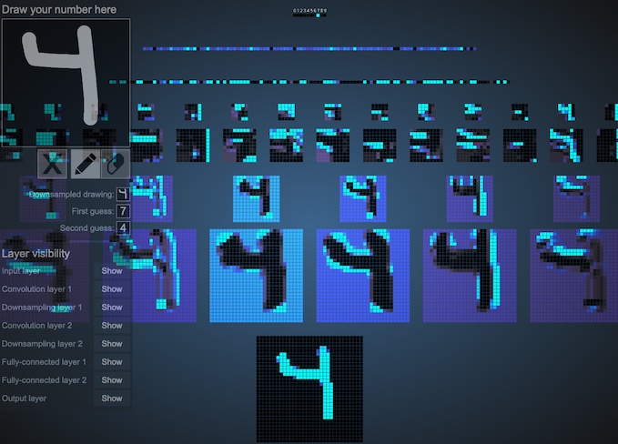
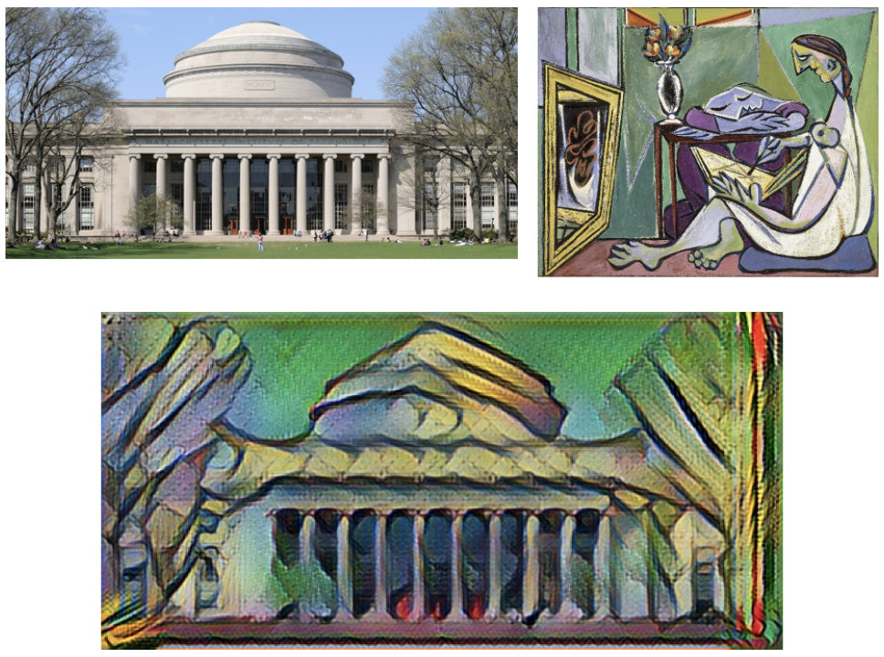

# Assignment 5: Convolutional Neural Networks
Adapted by Mark Sherman <shermanm@emmanuel.edu> from MIT 6.S198 under Creative Commons
Emmanuel College - IDDS 2132 Practical Machine Learning - Spring 2021

This assignment is based on work by Yaakov Helman, Natalie Lao, and Hal Abelson

1.1: Experimenting with convolutional models
============================================

Start up Model Builder: the same demo you've used for assignment 2,[ ](https://courses.csail.mit.edu/6.s198/spring-2018/model-builder/src/model-builder/)

<https://courses.csail.mit.edu/6.s198/spring-2018/model-builder/src/model-builder/>

**Set the Dataset input to MNIST, and set the Model input to Convolutional.** You'll see that this constructs a fairly elaborate model. There are two pieces, each piece consisting of three layers---a convolutional layer, a max pool layer, and a ReLU activation layer---and the entire thing feeding through a flatten layer to a fully connected layer with 10 hidden units. **Let the network train for a bit.** You should see that it quickly gets over 90% accuracy. (Move the cursor over the accuracy plot line to display the accuracy.)

**Now switch the Dataset to CIFAR 10 and train that.** The model still works, but doesn't do nearly as well: it should reach 50% accuracy after training with 40,000 examples. (Hal Abelson at MIT ran it for a million examples and it barely reached 80% accuracy.) 

**While the model is training, take a look at the hyperparameters and the input and output shapes of the layers.** 
- The first (lowest) convolutional layer has input shape `[32,32,3]`: the CIFAR images are 32⨉32 pixels and there are three RGB colors per pixel.
- The output shape is `[32,32,16]`: for each input pixel the convolutional layer generates 16 output values, as specified by the output hyperparameter for the layer.
- The first max pool layer takes that `[32,32,16]` input shape (unchanged by ReLU) and reduces it to `[16,16,16]` in accordance with the `field = 2` hyperparameter. We'll examine the meanings of these and other hyperparameters below.

1.2: How convolutional neural networks works
============================================

See Lecture recording from March 1, and the [R3 assignment in ECLearn](https://eclearn.emmanuel.edu/courses/3147959/assignments/31612152). If you haven't read and watched this material yet, now is the time to go do that before you continue. 

1.3: Experimenting with hyperparameters
=======================================

Now that you have an idea of what the layers and hyperparameters mean, **spend a few minutes modifying the network in Model Builder to see how these affect performance on CIFAR 10.**

For example, trying removing one of the Conv, ReLU, Max pool triples and see how that affects performance. Or try changing the number of outputs for the conv layers, or the field size or stride for the conv or max pool layers. Try at least three different variants that you train for 20,000 or 30,000 examples each and take notes on whether they make a difference (better or worse). Note that changing hyperparameters may require changing other hyperparameters to make the layer sizes consistent.

1.4: Visualizing convolutional neural networks
==============================================

To gain some intuition about how convolutional neural networks work, visit the Web page at [http://scs.ryerson.ca/~aharley/vis/conv/flat.html](http://scs.ryerson.ca/~aharley/vis/conv/flat.html). It looks like this:



This is a visualization demo by Adam Harley, described in the paper "An Interactive Node-Link Visualization of Convolutional Neural Networks" (<http://www.cs.cmu.edu/~aharley/vis/harley_vis_isvc15.pdf>). It shows a network with two convolutional layers, two fully connected layers, and two max pool layers (called "downsampling" in the demo). Unlike Model Builder, the input layer is at the bottom and the output label layer at the top. The network was trained on MNIST; the labels are the digits 0 through 9.

You can use the demo's pencil and eraser tools to create inputs to the network and see how these are transformed by the filters at each layer of the network. If you click on any square at a layer, you can see the inputs and output of the neuron at that square. Notice that the convolutional layer applies tanh as an activation function to the result of the weight; the demo doesn't show this as a separate activation layer.

## WRITEUP REQUIRED - Problem 1

Spend some time playing with this demo. Draw an input, modify it, and observe how the results at each layer change as you change the drawing. Create some inputs that look vaguely like digits, but that confuse the network, i.e., where two or more of the labels register. Write up interesting observations about what you see combined with illustrative screenshots.

> Problem 1 response here

2: Style transfer examples
============================================================

Share the interesting examples of style transfer that you created. Insert images and your written story of making them here. 

3.1: Style transfer
===================

Style transfer is the technique of re-creating one image in the style of another. The overall content of one image is preserved but appears to have been painted with the style of another image.

Here's an example–a photo of the MIT Dome, Picasso's painting *La Muse*, and the photo rendered in Picasso's style:



Besides being fun to play with, style transfer is an instructive example of using CNN's. It illustrates some important ideas:

1\. You can use neural nets to generate new examples as well as to classify existing examples.

2\. You can combine attributes from multiple examples.

3\. Just as with Teachable Machine in assignment 1, you can take advantage of transfer learning: use pre-trained deep network classifiers to generate useful attributes for manipulating images.

The key idea behind style transfer is that we can think of an image as having two aspects: content and style. You can relate these to how images are processed by multilayer CNNs.

Style transfer is the technique of recomposing one image in the style of another. Two inputs, a content image and a style image, are analyzed by a convolutional neural network which is then used to create an output image whose content mirrors the content image and whose style resembles that of the style image. Style transfer was first demonstrated in the paper "A neural algorithm of artistic style" by Gatys, Ecker and Bethge at the University of Tübingen in August 2015. It continues to be of great interest both to artists and scientists. You can find the paper at[http://arxiv.org/abs/1508.06576](http://arxiv.org/abs/1508.06576)

3.2: Computing image content
============================

Start with a multilayer CNN that has been pre-trained on a large collection of images. As we saw earlier this week, each layer of the CNN includes several filters, where each filter uses convolution to process the output of the filters from the preceding layer. The filters in the first layer respond to small patterns contained in small patches of the image. Filters in higher layers respond to patterns in the outputs of the layer below ("patterns of patterns"). The higher the layer, the less the filter outputs result from small details of the image, and the more they result from the general overall structure. The fact that the network has been pre-trained means that the patterns here reflect the structure of actual images.

We can use this idea to "compute the content" of an image A: Process image A with the trained CNN, pick a level that we'll call the content layer: the outputs of all the filters at that level will be the "content of the image". The choice of content level is up to us.

The output of each filter is a sequence of numbers generated by the convolution operation as the filter slides over the input. This sequence is called the "activation map" for the filter on that input. 

Concatenating all the activation maps for all the filters in the content layer produces a long sequence of numbers `C(A)` that will be our representation of the image content: We'll say that image `A` and image `B` have "similar content" if `C(A)` and `C(B)` are close. That is, if we view `C(A)` and `C(B)` as vectors, then we can define `ContentDiff(A,B) = ||C(A) - C(B)||` to be the norm of the difference vector `C(A) - C(B)` and we can use this as a measure of the difference between the content of `A` and the content of `B`. This is much the same idea as in the previous Teachable Machine assignment, where we used output of the top layer units of MobileNet to classify images.

3.3: Computing image style
==========================

Computing the "style" of an image is less straightforward. The insight is that style (in the judgement of visual observers) does not depend on where the lower-level details are located in the overall image, but rather on how the details (as filtered by several lower-level layers) are correlated. To represent the style of an image `B`, we pick a set of layers that we'll call the "style layers". For each style layer we compute the activation maps for all the filters in that layer, just as we did for the content layer above. Only this time, rather than just taking all values of all the activations, we examine how the activations of the different filters are correlated with each other.

More formally, if there are `N` filters in the layer, and if we view the activation map for each filter as a vector, we form the `N⨉N` matrix `G(B)` whose `(i, j)` element is the dot product of the vector for filter `i` with the vector for filter `j`. This matrix is called the "Gram Matrix" for the chosen layer. Its values indicate how the activations for the different filters for that layer occur together. We'll say that image `A` and image `B` have similar style with respect to the chosen layer if their two Gram matrices `G(A)` and `G(B)` for that layer have elements that are close in value. To define the style difference between A and B for a given layer, we subtract the two Gram matrices and take the sum of the squares of all the elements in the difference matrix. We'll define the overall `StyleDiff(A,B)` to be the sum of the style differences between `A` and `B` for each of the layers that were selected to be style layers.

3.4: Transferring the style to the content image
================================================

Performing style transfer of a style image `X` to a content image `Y` uses deep learning methods to generate an image `Z` whose style matches the style of `X` and whose content matches the content of `Y`. We start with a guess for `Z` (initially random noise) and define the error in the guess to be the sum of `StyleDiff(X,Z)` and `ContentDiff(Y,Z)`. In a similar way to how multilayer networks are trained, one can compute the derivative of the error with respect to each of the pixel values of the guessed image `Z` to minimize that distance sum. This will let us use gradient descent to make an improved guess for `Z`. We continue improving the guess until the error is small, and this produces the style transfer result.

As with many machine learning systems, there are many hyperparameters available for tuning in order to get good results. First, there are the usual hyperparameters involving learning: learning rate, batch size, and so on. Then there's the design of the CNN itself: number of layers, patch size, activation functions, pooling, and more. Then there's choice of which layers to pick a the convolution layer and the style layers in performing the style transfer. Finally, people sometimes weigh how much to consider content versus style in creating the transfer: Choose a weighting factor `W` between 0 and 1 and take the error to minimize to be 
```
W⨉StyleDiff(X,Z) + (1-W )⨉ContentDiff(Y,Z)
```

3.5: Fast style transfer
========================

The style transfer method described above is slow, several minutes per image, due to the multiple passes through the CNN required to perform gradient descent to improve the image guess. Fast style transfer speeds up the process so that new styled images can be generated in real time: one can even style video!

The trick is to precompute an image transformation network that is specialized to a given style and choice of content layer and style layers. One you have this network, you use it as a "feed-forward network": if you feed in a content image the network will output the pixel values of the transformed image quickly, in a single pass, with no training.

To compute this feed-forward network, you use a pre-trained CNN and pick a style image together with content and style layer levels using just as with ordinary style transfer. But instead of processing only one content image, you proces many content images in succession For each content image, you modify the weights in the network, using gradient descent, to minimize the sum of the style distance and the content distance. Processing each successive content image makes new successive modifications. The result, after processing many content images, is a network that is able a style transfer of many input content image for the chosen fixed style image. Given that this works for "many" content images, the fast-style transfer is assumed (without proof) to be adequate for any content image. Finally, you use the resulting network as a one-shot feed-forward network for processing content images.

Generating a style transfer with the feed-forward network is fast, but creating the network is a long computation, due to the large number or content images that need to be processed. It takes several hours on a fast machine to produce the image transformation network for a single style. But once you have the network, you can perform real-time style transfer on content images in hundreds of milliseconds.

## WRITEUP REQUIRED - Problem 2

Use the demo site at Fast Neural Style Transfer with Tensorflow.js at

<https://reiinakano.com/arbitrary-image-stylization-tfjs/>

to generate some examples using the pre-computed styles. You can choose from the provided content images, or upload your own images, or even use the camera. Save screenshots of some examples to submit with your homework for each of the following cases:

1\. What happens when you pass an image through the same filter several times? Do you observe any interesting characteristics or padding artifacts?

> 2.1 response

2\. Apply a filter to an image and then apply another filter to that already-filtered image. Is the result similar to what you would get when you apply the second filter to the original image?

> 2.2 response

3\. Try different combinations of filters and number of times you filter an image. Note on if you have any interesting observations or insights.

> 2.3 response

3.6: Building CNNs 
==================

Last week you explored fully connected networks with model builder. This week's homework covers the same experimentation with CNNs.

## WRITEUP REQUIRED - Problem 3

Similar to the work you did with Model Builder on Monday, investigate several choices of architectures and hyperparameters for classifying images from MNIST, Fashion MNIST, and CIFAR_10. For the following 4 questions, describe what architectures you implemented and take screenshots of the results you got for each dataset (MNIST, Fashion MNIST, and CIFAR).

Remember to add an image, put it in this folder and use the markdown code ``

1\. Try changing the learning rate, and batch size. Make sure that these numbers are reasonable to start (i.e. won't take too long to run on your computer).

2\. Try changing the optimizer. Some optimizers have additional parameters- see what impact they appear to have, then try to find some documentation as to what they're doing to the model. Do your best to explain how those parameters are impacting your observations.

3\. Do you have a hypothesis for why CIFAR-10 is so much harder to train on than Fashion MNIST and MNIST (i.e. it's more difficult to achieve a 90%+ accuracy) while Fashion MNIST has similar training times to MNIST (even though Fashion MNIST is more complex than MNIST)?

4\. How does adding more convolutional layers relate to accuracy and training speed? Is there a point at which adding more layers plateaus or even decreases the maximum accuracy you are able to achieve with that model?

5\. Challenge: Are you able to find an architecture/combination of techniques that can get you to 60% accuracy on CIFAR-10 within 1 minute of training? 5 minutes? 10 minutes?

3: Submission 
==============

Commit images and this file to git, and push. It is considered submitted when you push changes. I will evaluate the project after teh due date, so you can push multiple times prior to then. You don't have to push each commit separately. One push at the end is fine. 


This work is licensed under a [Creative Commons Attribution 4.0 International License](http://creativecommons.org/licenses/by/4.0/).
